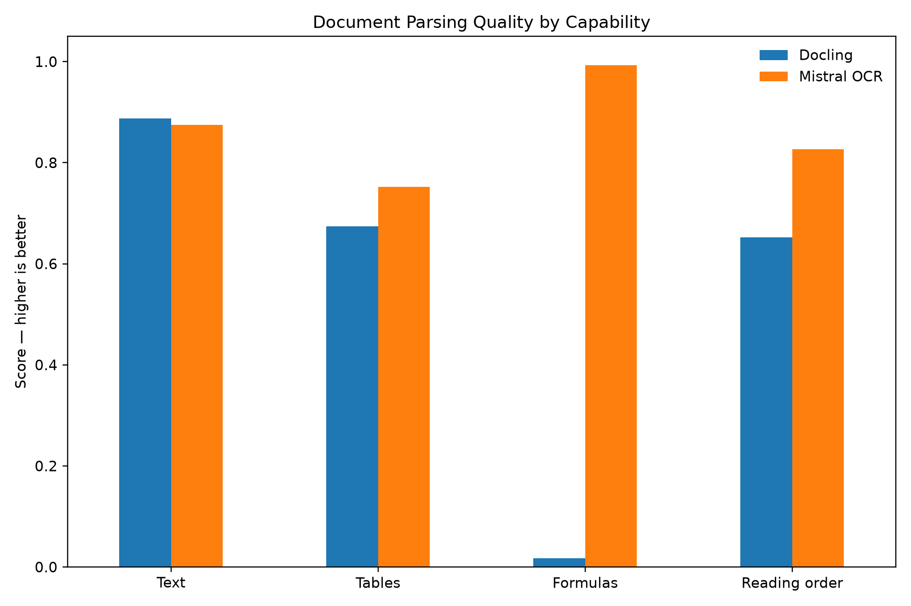
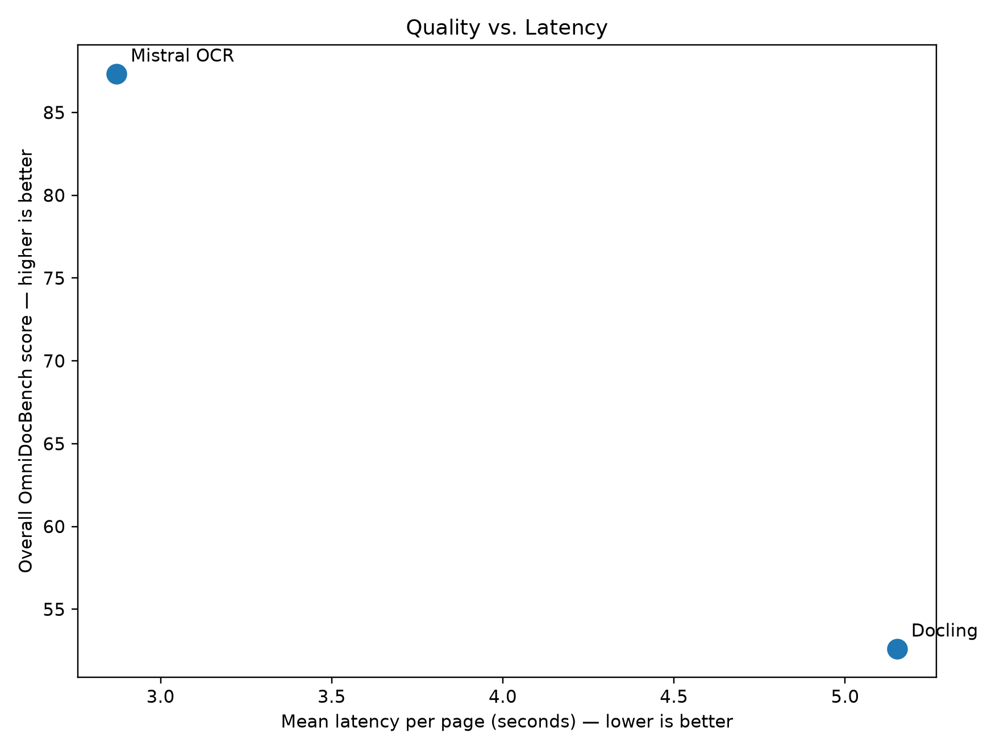
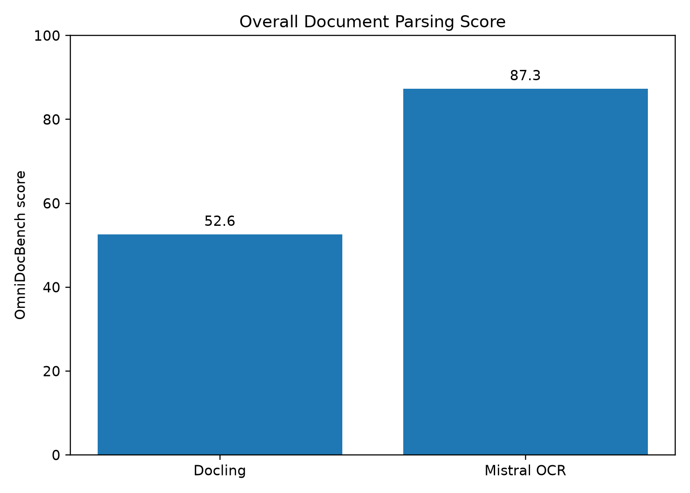
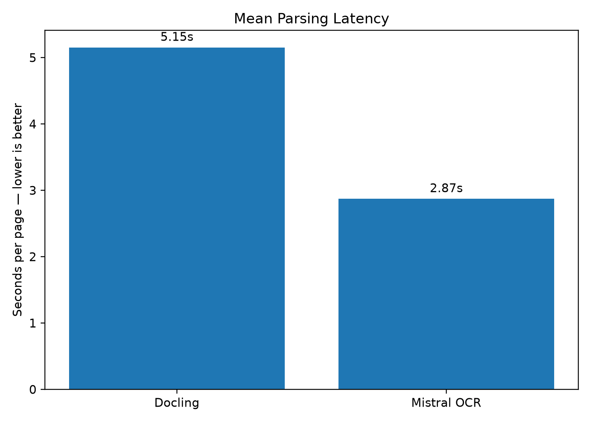

# Document Parsing for AI Agents

A reproducible **quality × latency × cost** benchmark for document parsers used in AI workflows.

**v0 pilot · 20 OmniDocBench pages · Docling vs Mistral OCR 4.1**

---

## What this benchmark asks

Document parsing is an upstream dependency for RAG systems and AI agents. A parser can preserve the document structure an agent needs — or quietly destroy it.

This pilot compares two parsers on the **same frozen visual inputs** and measures:

- text extraction
- table reconstruction
- formula extraction
- reading order
- end-to-end latency
- API cost
- failures

The goal is not just to ask **“which parser scores highest?”**, but **“which parser is the better fit for a given workload?”**

---

## Results

| Provider | Overall ↑ | Text edit ↓ | Table TEDS ↑ | Table structure ↑ | Formula CDM ↑ | Reading-order edit ↓ | Mean latency ↓ | Failures |
|---|---:|---:|---:|---:|---:|---:|---:|---:|
| **Mistral OCR** | **87.34** | 0.125 | **0.752** | 0.829 | **0.993** | **0.173** | **2.87s** | 1 |
| **Docling** | 52.62 | **0.113** | 0.674 | **0.840** | 0.017 | 0.348 | 5.15s | **0** |

**↑ higher is better · ↓ lower is better**

### What stood out

- **Mistral OCR led on overall score, tables, formulas, reading order, and measured latency.**
- **Docling slightly led on plain-text edit distance and table-structure TEDS.**
- The largest gap was in **formula extraction**: `0.993` vs `0.017`.
- Mistral had **1 failed page**; Docling completed all 20.
- Docling has **$0 API fee**, but local compute cost is not included.

This is a **20-page pilot**, so the results are directional rather than a definitive industry ranking.

---

## Capability comparison



Text performance is relatively close. The larger differences appear in formulas and reading order.

Table performance is more nuanced: Mistral leads on full Table TEDS, while Docling slightly leads on structure-only TEDS.

---

## Quality vs latency



Measured mean latency:

| Provider | Mean | Median |
|---|---:|---:|
| **Mistral OCR** | **2.87s** | **2.56s** |
| **Docling** | 5.15s | 3.54s |

Latency is **developer-observed wall-clock time**, not hardware-normalized inference speed:

- Docling ran locally.
- Mistral ran through a hosted API.
- Docling cold-start/model-download time was excluded.

---

## Overall score



The aggregate score is useful, but it should not replace capability-level analysis. A parser that performs well overall can still be a poor fit for equation-heavy, table-heavy, or complex-layout workloads.

---

## Latency



---

## Cost

### Mistral OCR

- Total recorded API cost: **$0.076**
- Mean cost per attempted page: **$0.0038**

### Docling

- External API fee: **$0**
- Local compute, infrastructure, and engineering costs: **not included**

So `$0 API fee` should not be interpreted as `$0 production cost`.

---

## Dataset

The benchmark uses **OmniDocBench**, a document-parsing dataset with human-reviewed annotations for text, tables, formulas, layout, and reading order.

For this v0 pilot, I sampled **20 English-language pages** with a fixed seed:

| Cohort | Pages |
|---|---:|
| `table_hard` | 5 |
| `equation_hard` | 5 |
| `layout_hard` | 5 |
| general `v1.5` | 5 |

Not every page contains every content type. The official evaluator scored:

- text: 19 pages
- tables: 7 pages
- display formulas: 7 pages
- reading order: 20 pages

---

## Fairness and methodology

Every provider received the **same image-only single-page PDFs** generated from the frozen OmniDocBench page images.

This prevents one parser from benefiting from an embedded PDF text layer.

Pipeline:

```text
OmniDocBench page image
        ↓
frozen image-only PDF
        ↓
provider parser
        ↓
Markdown output
        ↓
official OmniDocBench evaluator
        ↓
quality + latency + cost + failures
```

Metrics:

- **Text edit distance** — lower is better
- **Table TEDS** — higher is better
- **Table structure TEDS** — higher is better
- **Formula CDM** — higher is better
- **Reading-order edit distance** — lower is better
- **Overall score** — OmniDocBench aggregate

Raw provider outputs and evaluator artifacts are preserved so results can be inspected below the leaderboard.

---

## Reproduce

Create the environment:

```bash
python3 -m venv .venv
source .venv/bin/activate
pip install -r requirements.txt
```

Run providers:

```bash
PYTHONPATH=. python scripts/run_docling.py
PYTHONPATH=. python scripts/run_mistral.py
```

Export predictions:

```bash
PYTHONPATH=. python scripts/export_provider_for_eval.py --provider docling
PYTHONPATH=. python scripts/export_provider_for_eval.py --provider mistral_ocr
```

Save benchmark results:

```bash
python scripts/save_provider_result.py --provider docling
python scripts/save_provider_result.py --provider mistral_ocr
```

Generate figures:

```bash
python scripts/create_figures.py
```

Final consolidated results:

```text
results/provider_results.csv
```

---

## Limitations

This is intentionally a **v0 methodology pilot**.

- Only 20 pages
- English only
- Two providers
- Local and hosted latency are not hardware-normalized
- Docling compute cost is excluded
- The formula gap should be inspected at the raw-output level before being generalized broadly

The next version would expand the sample and add more production parsers, while keeping the same frozen-input and scoring methodology.

---

## Takeaway

On this pilot, **Mistral OCR produced the stronger overall result**, especially on formulas and reading order, while **Docling remained competitive on text, slightly led on table structure, ran locally, and avoided metered API fees**.

The more useful benchmark question is not:

> Which parser wins overall?

It is:

> **Which parser should an AI agent use for this document, under this quality, latency, and cost constraint?**
